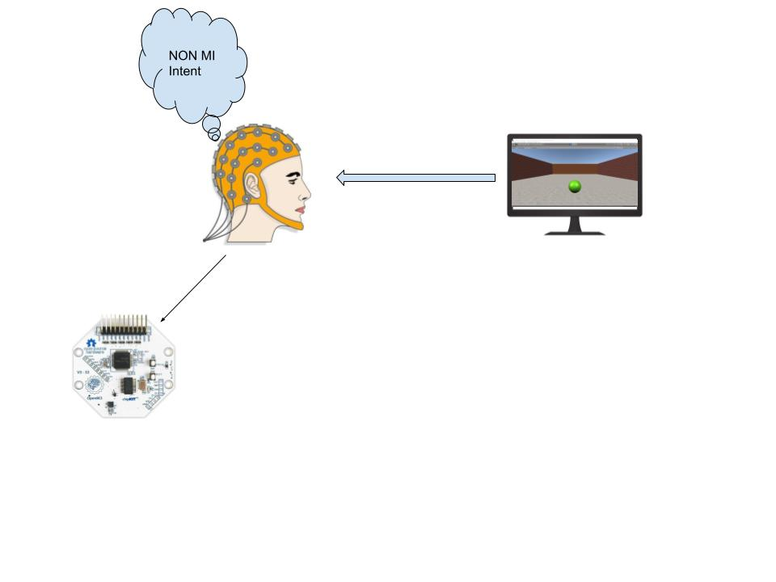
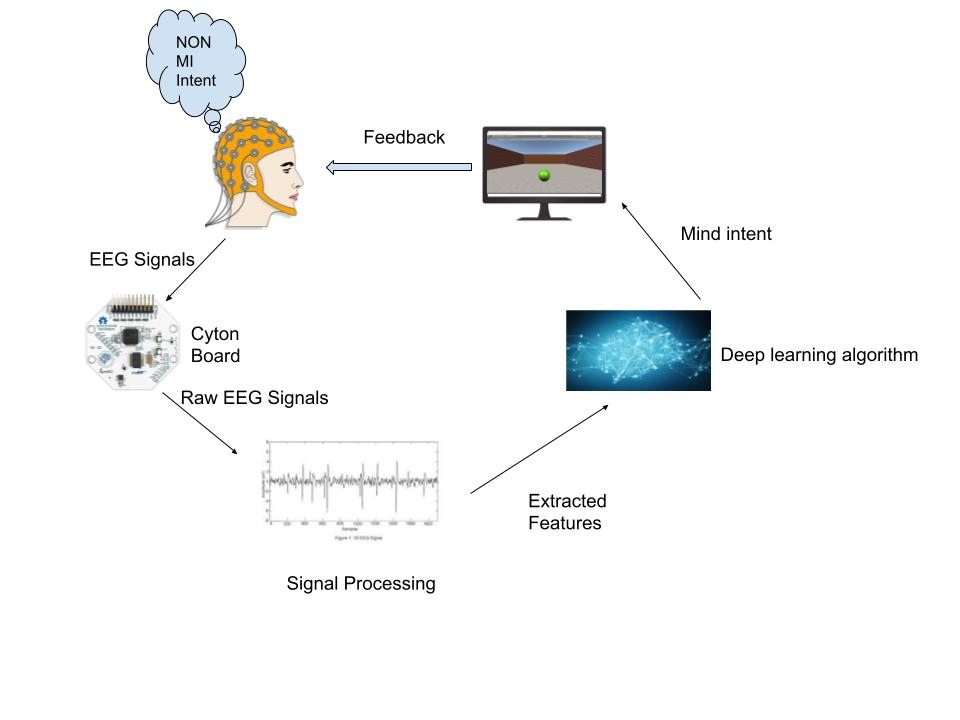
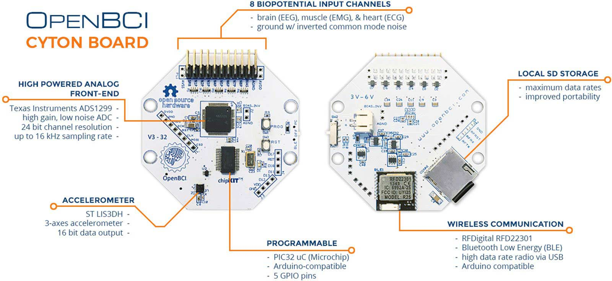
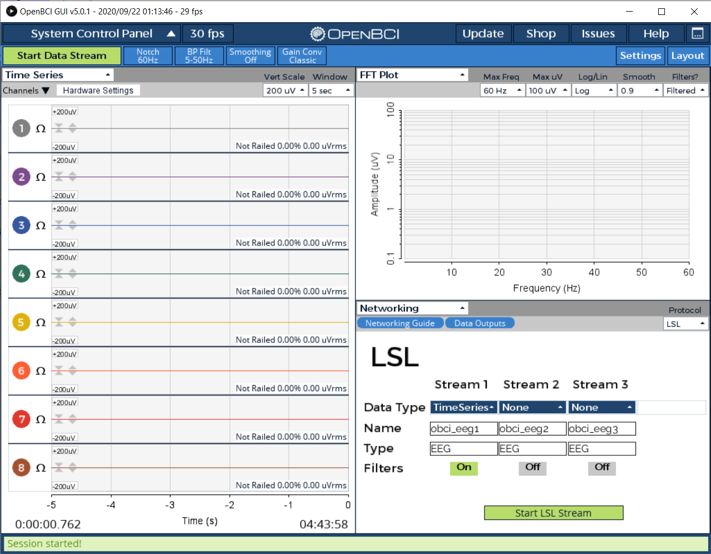
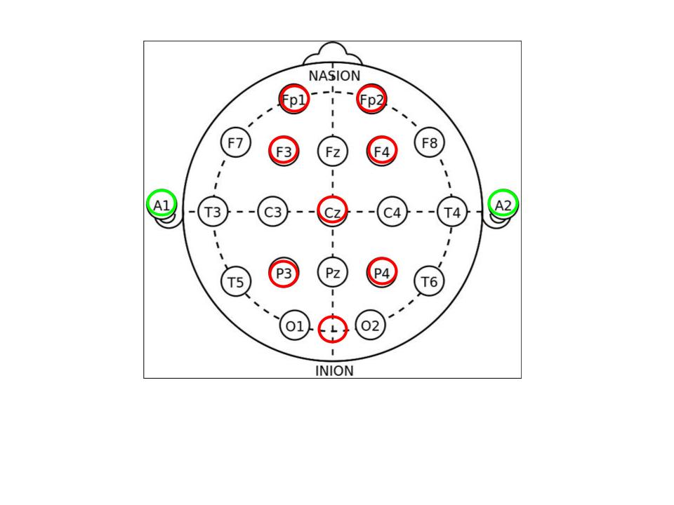
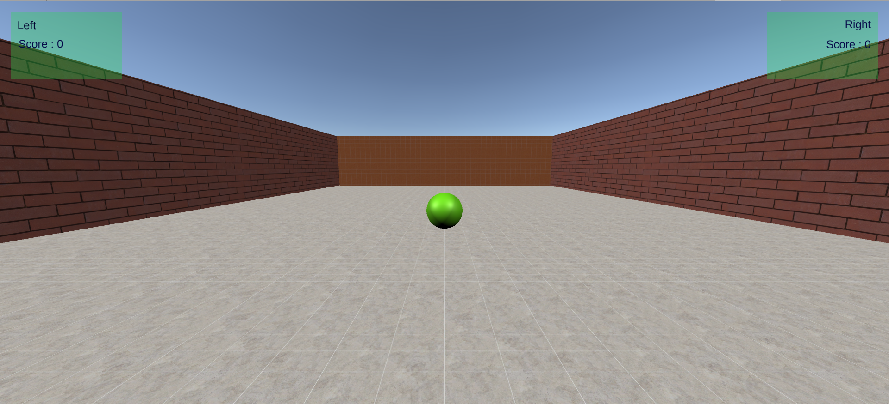
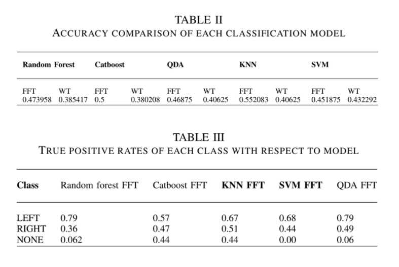
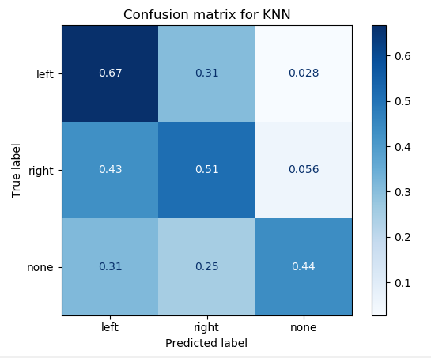

[comment]: # "This is the standard layout for the project, but you can clean this and use your own template"

# Project Title

#### Team

- E/15/023, Avishka Athapattu, [email](mailto:e15023@eng.pdn.ac.lk)
- E/15/059, Prageeth Dassanayake, [email](mailto:e15059@eng.pdn.ac.lk)
- E/15/238, Sewwandie Nanayakkara, [email](mailto:sewwandiecn@gmail.com)

#### Supervisors

- Dr. Isuru Nawinne, [email](mailto:isurunawinne@eng.pdn.ac.lk)
- Prof. Roshan Ragel, [email](mailto:roshanr@eng.pdn.ac.lk)
- Theekshana Dissanayake, [email](mailto:theekshanadis@gmail.com)

#### Table of content

1. [Abstract](#abstract)
2. [Related works](#related-works)
3. [Methodology](#methodology)
4. [Experiment Setup and Implementation](#experiment-setup-and-implementation)
5. [Results and Analysis](#results-and-analysis)
6. [Conclusion](#conclusion)
7. [Publications](#publications)
8. [Links](#links)

---

## Abstract

Non-invasive EEG based Brain Computer Interface (BCI) systems have been an interesting research area for many fields. However most of the research done on this subject is synchronous, therefore the state of mind of the user is not similar to its natural behaviour. Considering to provide possible experience in practical applications, self-paced BCI systems started gaining popularity in recent years. However, there are certain challenges yet to be addressed when following this method. Out of the research done on self-paced BCI systems most of them are focused on motor-imagery control whereas research on nonmotor imagery mental tasks is limited. In this research, we analyse the possibility of using the techniques used in the motorimagery method for non-motor imagery mental tasks to be fed into virtual object controlling applications.

## Related works

Both non-motor imagery EEG signals related to virtual object manipulation and motor imagery EEG signals are sensorimotor rhythms(SMR). These are specific brain waves over the sensorimotor cortex that are generated after MI or ME. In research by Faradji et.al <a href="https://cdn.intechopen.com/pdfs/65241.pdf">research paper</a>, they explored the idea of rotation of a virtual object in 3D space in a more natural way. They used auto scalar auto-regressive methods for feature extraction and the classification was done with quadratic discriminant analysis. They obtained a true positive rate (TPR) value of 54.6% TPR and 0.01% FPR. Although there are numerous researches on using motor imagery to control virtual objects that give us higher accuracy [2], research done by Faradji et al. explores the possibility of controlling objects in a more natural way. It was stated that although the TPR is relatively low compared to MI related research, this method is more preferable in real-time applications since this method requires less computational power.

  
## Methodology

The procedure of self-paced BCI module for virtual object controlling consists of 8 steps

1. The subject should know what are the activities that need to be done since it is important to induce brain waves related to those activities. Most of the research subjects practice to perform a minimum number of activities, for example in virtual object controlling, moving an object up and down, left and right.
2. Subjects should train without feedback provided to acquire the required data as well as to analyze signal patterns Fig 1. 
3. Preprocessing the data by artifact reduction(Electrooculogram(EOG), Electromyogram(EMG)) and signal filterings methods such as low-pass/high pass or bandpass filter 
4. Feature extraction to find a suitable representation of the electrophysiology data that simplify the subsequent classification or detection of specific brain patterns.
5. With the extracted features classifier being trained, the accuracy should be 70% or higher if not we have to recollect data and extract features and train a classifier model all over again.
6. Training in real-time with the help of visual feedback Fig.2.
7. Update the classifier if the frequency band or EEG pattern changes. (Post-processing)
8. Feed the classification output into an application interface with virtual objects.

 Figure 1

Figure 2

## Experiment Setup and Implementation

First we trained the subject to train three mind intents which are left, right, and None without any visual aid. Afterwards,
we trained the subject with GUI aid. We used an OpenBCI Cyton board to capture EEG data in the experimental setup and signals were processed using Python. EEG signals were fed for processing and denoising. We used the OpenBCI GUI to send EEG signals
through LSL (Lab Streaming Layer) into a Python application where we extracted the features. Our subject was a male volunteer, of age 24. Initially the subject performed a mental task while watching a virtual object on a screen. This training was done in a limited time trial like 0 -10 seconds, because the performance of the mental task degrades over time. 

<h5>A. Cyton Board (Hardware platform)</h5>

Cyton board is an Arduino compatible wireless device which is able to capture EEG signals. It consists of 8 biopotential input channels. It must be powered up with 3-6V DC battery only. It has the ability to send samples at 250Hz frequency. Each packet contains a header followed by a sample counter, followed by 8 ADS channel data, followed by the three axes values of the accelerometer, followed by a footer. The USB dongle is connected to the laptop where the cyton board communicates with it using Bluetooth to transfer data.

Figure 3

<h5>B. OpenBCI GUI and LSL</h5> 

OpenBCI GUI (fig 4)<a href="https://openbci.com/index.php/downloads">here</a> is a powerful software that is used to visualize, record and stream data from OpenBCI boards. This GUI helps to visualize data coming from eight channels of Cyton board to understand if there are any faults in connections. If there are external disturbances that  interfere with the visualization of EEG signals it can be recognized as well. It also visualizes the real-time representations of FFT, power spectral distribution and time series.

Figure 4

Lab Streaming Layer is a system developed for synchronising streaming data for real-time analysis and recording. This is used to send the raw EEG data as time series into a python application for signal processing. PyLSL library is used to input the data to the python application. We are taking in time series EEG data. Data is transferred at 250Hz. Each sample contains data of each channel as floats.

<h5>C. Electrodes and electrode placement</h5>

We used eight Golden cup electrodes to sample EEG data. We placed those on the subject according to the 10-20 method. The 10–20 system or International 10–20 system is an internationally recognized method to describe and apply the location of scalp electrodes in the context of an EEG exam. EEGs were placed in 10% and 20% spaces on the scalp as follows. The brain waves related to controlling virtual objects are induced in the motor cortex so electrode placement positions are chosen so as to extract the maximum amount of information. In our experiment, we placed electrodes as shown in Fig. 5.

Figure 5

<h5>D. Virtual Environment</h5>

Virtual objects that were meant for controlling are created with Unity. The subject is trained on a virtual environment where the display is 15.6 inch, monitor resolution of 1920 x 1080 p and 60Hz. Data of mind intent will be recorded where the subject will focus on moving the objects along axes. Shown in Fig. 6 is the virtual environment we created.

Figure 6

## Results and Analysis

Frequency bin components extracted by FFT and Detailed coefficients extracted by wavelet transform were used as features for the classification purpose. All the classifications have the ability to perform in real time. We used Random Forest, QDA, KNN, Catboost and SVM for classifying. In Table II we have compared the accuracies between different classification models. Table III gives the TPR of each class with respect to the model. The confusion matrix of the KNN model is shown in Fig.7.

figure 7

  
 

<iframe width="100" height="auto" src="https://www.youtube.com/embed/mYRCd9_oo3Y" title="Demonstration" frameborder="0" allow="accelerometer; autoplay; clipboard-write; encrypted-media; gyroscope; picture-in-picture" allowfullscreen></iframe>
 

## Conclusion

Filters that were used in EEG signal processing causes a phase shift that makes the usage of wavelet features impossible. Therefore we have used the FFT feature extraction method to provide frequency bins as features for our classification methods. But by substituting those filters (Butterworth filter) with others (zero phase filters) the effect of the phase shift can be removed. We can explore the possibility of using a combination of features provided by WT and FFT to train a more accurate classification model. With all the classification models that were trained KNN algorithm with FFT algorithm would be the ideal choice of features and classification combination. We were able to obtain around 55% TPR value. By implementing statistical analysis we can rectify the anatomical localization effects on EEG data would further increase accuracy of these models. Deep learning methods proved to have a lot of potential when it comes to MI based research in recent history. Possibility of using deep learning approaches in non motor imagery
intent with self phased brain computer interfaces is something that can be explored as well.

## Publications
1. [Semester 7 report](./)
2. [Semester 7 slides](./pubs/semester_7_slides.pdf)
3. [Semester 8 report](./pubs/final_report.pdf)
4. [Semester 8 slides](./pubs/semester_8_slides.pdf)
5. Athapattu A.D., Dassanayake P.S.B., and Nanayakkara G.S.C., "Self Paced Brain Computer Interface On Sensoriomotor Rhythms For Virtual Objects Controlling" (2021). [PDF](./pubs/research_paper.pdf).

## Links

[//]: # ( NOTE: EDIT THIS LINKS WITH YOUR REPO DETAILS )

- [Project Repository](https://github.com/cepdnaclk/e15-4yp-Brain-Computer-Interface-for-controlling-virtual-objects)
- [Project Page](https://cepdnaclk.github.io/e15-4yp-Brain-Computer-Interface-for-controlling-virtual-objects)
- [Department of Computer Engineering](http://www.ce.pdn.ac.lk/)
- [University of Peradeniya](https://eng.pdn.ac.lk/)

[//]: # "Please refer this to learn more about Markdown syntax"
[//]: # "https://github.com/adam-p/markdown-here/wiki/Markdown-Cheatsheet"
